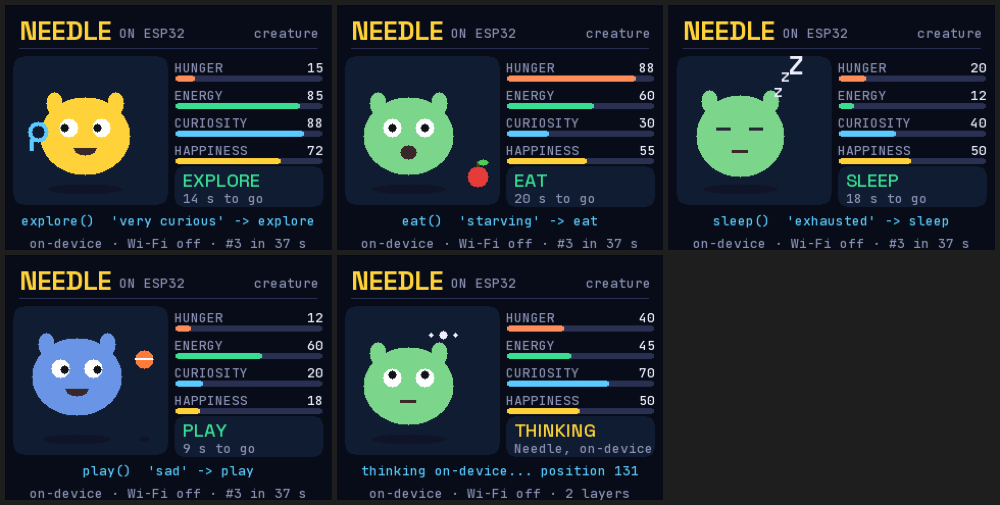

# Needle on a £15 ESP32

Cactus Compute's **Needle 3** tool-calling model runs entirely on a stock
**Cheap Yellow Display** (ESP32-2432S028R: one ESP32-D0WD-V3, 520 KB SRAM,
4 MB flash, **no PSRAM**). There is no Raspberry Pi, computer, phone, cloud or
Wi-Fi in the loop once it is flashed. You set how the creature feels on the
touchscreen, press THINK, and about 37 seconds later the ESP32 has chosen
`eat()`, `sleep()`, `explore()` or `rest()`. It does this by running Needle's
own network over Needle's own weights, read from a microSD card.

```
RESULT
------

Needle inference on stock CYD:
WORKING

Model:
Needle 3, 2-layer ladder rung (blocks 0 and 19 of the shipped 20), 2-bit Cactus
Quants. Demo model: that rung LoRA-tuned on the four-tool task with Needle's own
training loop through 2-bit numerics. Every tensor except the 10 attention
matrices is byte-identical to the official 2-bit rung. The untuned official
rung also runs on the board.

Layers:
2 (25.4 M parameters; 8.6 MB .cact)

Model storage:
microSD (the 2-bit matrices, 5.0 MB) + the ESP32's own flash, memory-mapped
(a verbatim copy of the embedding / output head, the tokenizer, every FP16
vector and the mHC maps: 59 tensors, 3.57 MB)

Peak RAM:
195 KB runtime heap (+55 KB static); 10.4 KB heap left at the lowest point.
No weight is ever held in RAM.

Inference speed:
37.2 s per decision on the board (34.6-41.6 s over 24 cases); about 35
network positions per decision (turn, 8-10 reasoning tokens, call); first boot
per model adds a one-off 2-minute prefix build, cached on the card.

Tool-call accuracy:
24/24 on the board, identical to the Mac build of the same runtime on all 24
(call and reasoning text); 24/24 on the shipped engine on the Mac. Base Needle
without tuning gets 8-13/24 on this task at every depth, including the full 20
layers.

Biggest remaining bottleneck:
SD card bandwidth: about 60% of each decision is reading 1.4 MB of 2-bit
weights per position at the card's ~2.2 MB/s SPI ceiling. RAM is the reason it
cannot batch positions to read each weight once for several tokens.

Most promising next optimisation:
Batched prefill of the user turn (~24 of the ~35 positions): read each
weight tile once for 2-4 tokens. Needs about 48 KB more working RAM than the
stock board has free, so first shrink the KV cache (int8 → 4-bit, as Needle's
kv_bits allows) or move the q/k/v work buffers into the ESP32's spare IRAM
(integer access only).
```

The four-action demo and an autonomous creature (stretch goal, below) are both
on the card; the debug screen switches between them.



*An independent project, not affiliated with or endorsed by Cactus Compute.
Needle's weights are not in this repository; the tools download them from
Cactus Compute. See NOTICE.*

## What is genuinely running on the ESP32

Everything between the touchscreen and the decision:

- **Tokeniser**: SentencePiece BPE, decoded from the RAW tensor inside the
  `.cact` archive. Its surface index is built on the board at first boot.
- **The whole network, one position at a time**:
  - the embedding gather;
  - engram n-gram hashing and table gathers;
  - the multi-lane (mHC) residual with its Sinkhorn mixing;
  - attention with causal conv taps, RoPE and an int8 KV cache;
  - the Hadamard (Monarch) MLP.
- **Output head**: the tied 8192 × 768 embedding. It is read in full for every
  reasoning token, and only for the grammar-allowed rows while the call is
  decoded.
- **Constrained decoding**: greedy reasoning, then Needle's tool-call JSON
  decoded under a byte-level grammar, e.g. `[{"name":"rest","arguments":{}}]`.
- **Confidence**: for the base model, Needle's confidence head (probe pool)
  combined with the call probability.

**Not on the device:**
- Training the fine-tune (Mac, JAX, Needle's own code).
- Preparing the card.
- The Mac-side oracle and benchmarks.

**Nothing is faked:**
- No rules pick the action.
- No answers are prerecorded.
- There is no remote call.
- The sentence the board feeds Needle, e.g. "I'm not hungry, tired and bored.",
  is built from the three sliders by fixed word buckets
  (`firmware/app/state_text.cpp`); Needle decides from that text alone.

### How we know it is Needle, bit for bit where it can be

| check | result |
|---|---|
| NumPy token-at-a-time oracle vs the reference JAX model (`tools/check_ref.py`) | logits cosine ≥ 0.999998, top-1 100%, confidence logit within 0.004 |
| this C++ runtime vs the oracle (`tools/check_host.py`, `tests/test_golden.py`) | identical token ids; cosine ≥ 0.99999; top-1 100%; identical 12-token reasoning; confidence logit within 1e-4 |
| probe pool vs the shipped engine's `needle_embed` | cosine 0.99999 |
| runtime vs the shipped engine, base 2-bit rung, "I need a rest" | identical reasoning text and call |
| board vs Mac build, 24 benchmark cases, twice | identical call and reasoning text on all 24 |

## What was found along the way

- **Needle was never trained to infer a decision from a state description.**
  "I'm hungry" → `eat()` works on the full model. But reading "hunger 95,
  energy 60" and choosing does not, at any depth (25–54%). The small rungs
  also loop inside `<think>` for hundreds of tokens. Needle's documented
  remedy, fine-tuning a small rung on the product's tools, fixes both: 24/24,
  and 8–10 reasoning tokens.
- The shipped engine's `--depth N` flag is ignored. Small rungs have to be
  sliced files (`tools/slice_cact.py`, byte-exact).
- `needle build` re-quantises everything at 4 bits; the shipped model is
  2-bit. `tools/finetune_rung_2bit.py` trains on the 2-bit rung itself and
  keeps its bytes.
- CQ re-encoding is not idempotent: the codebook points are not unit length,
  so the stored norm shrinks about 6% every pass. The encoder here stores the
  least-squares norm instead. The format and the reconstruction are
  unchanged, and it is exact on already-quantised groups.
- The engine's own confidence number is not reproduced. It re-scores an id
  sequence built inside the closed binary. The runtime uses Needle's
  documented definition instead.
- On the ESP32:
  - stdio `fread` from SD is 20× slower than POSIX `read`;
  - unaligned DMA targets collapse SD throughput;
  - spare IRAM only takes 32-bit integer loads and stores;
  - this board's panel wanted the "ILI9341_2" init with no inversion and RGB
    order.

The full story, with numbers, is in `log.md`, `docs/feasibility.md`,
`docs/memory-budget.md`, `docs/architecture.md` and `bench/RESULTS.md`.

## Layout

```
firmware/
  needle_runtime/  the portable C++ runtime (also builds on the Mac: host/)
    cact_reader    .cact directory + storage backends (SD file, flash partition, overlay)
    tensor         CQ2/CQ4 kernels that consume the archive bytes directly
    model          the forward pass, KV cache, confidence probe pool, state snapshots
    tokenizer      SentencePiece BPE from the archive's RAW blob
    grammar        byte-level tool-call automaton (+ jump-forward)
    inference      one Needle turn: prefix snapshot, think, call, confidence
  storage/         SD over SPI, flash partition (mmap), overlay, snapshots
  ui/              ILI9341 without a framebuffer, 4-bit AA fonts (OFL), XPT2046, LED
  app/             state → sentence, the creature world, benchmark cases
  main.cpp         boot, profiles, touch UI, serial console
host/              desktop build of the same runtime (oracle checks, benchmarks)
tools/             slicer, oracle, fine-tuning, SD/flash preparation, file push, fonts
tests/golden/      oracle outputs; tests/test_golden.py checks the runtime against them
bench/             cases, tool lists, results, raw board logs
docs/              feasibility, memory budget, architecture, screenshots, upstream links
```

## Build and flash

The Mac side: Python 3.12, `uv`, ESP-IDF 5.3.1. Get Needle at the commit this
was built against:

```bash
git clone https://github.com/cactus-compute/needle vendor/needle && git -C vendor/needle checkout 42bf1f2d0a7784b0d4d1ec94bb5ade425cf9a67c
```

```bash
uv venv -p 3.12 .venv && uv pip install --python .venv/bin/python -e "vendor/needle[train]" pyserial pillow
```

```bash
.venv/bin/needle download needle3 --out models
```

```bash
.venv/bin/python tools/slice_cact.py models/needle3.cact 2 models/needle3-L2.cact
```

Optionally rebuild the tuned demo model (about 25 minutes on an M-series Mac):

```bash
.venv/bin/python tools/make_creature_data.py --n 2000 --balanced --out bench/creature_train_bal.jsonl
```

```bash
.venv/bin/python tools/finetune_rung_2bit.py bench/creature_train_bal.jsonl --base models/needle3-L2.cact --epochs 10 --rank 64 --alpha 128 --out models/needle3-L2-creature-2bit-r64.cact
```

Build the firmware (the first time, also `idf.py set-target esp32`):

```bash
source ~/esp/esp-idf/export.sh && idf.py build
```

Prepare the card and the flash overlay. This writes `sdcard/needle/…` (or
straight to a mounted card with `--card /Volumes/NAME`) and
`build/needle_overlay.bin`:

```bash
.venv/bin/python tools/prepare_sd.py models/needle3-L2-creature-2bit-r64.cact --label "2 layers, tuned 2-bit" --card "/Volumes/NO NAME"
```

Flash everything: bootloader, partition table, app and overlay.

```bash
python -m esptool --chip esp32 -b 460800 write_flash 0x1000 build/bootloader/bootloader.bin 0x8000 build/partition_table/partition-table.bin 0x10000 build/needle_cyd.bin 0x90000 build/needle_overlay.bin
```

(921600 baud was unreliable on this board's USB-serial chip.) The first boot
of each model builds `tok.idx` and `prefix.snap` on the card, in about 2
minutes; every boot after that is a few seconds.

To change the model without taking the card out, push it over USB. It is
CRC-checked per 512 B, at 460800 baud, and takes about 5 minutes for 8.6 MB:

```bash
.venv/bin/python tools/push_file.py /dev/cu.usbserial-1130 models/needle3-L2-creature-2bit-r64.cact /sdcard/needle/needle3.cact
```

Then flash the matching overlay (`prepare_sd.py` writes it) at `0x90000`.

## Serial console (115200 baud)

| command | what it does |
|---|---|
| `say <text>` | run Needle on any sentence; prints the result JSON |
| `set <hunger> <energy> <curiosity>` | set the sliders and THINK (drives the screen) |
| `bench` | the 24-case benchmark on the board (the creature's own set in creature mode) |
| `stats` | inferences, timing, bytes read, heap |
| `sdbench` / `sdraw` | SD throughput through the file layer / raw sectors |
| `recv`, `mv`, `reboot` | file push (used by `tools/push_file.py`), rename, restart |

Every decision prints one JSON line (the call, reasoning, confidence, token
counts, timings, bytes and reads, heap), plus `[io]` and `[prof]` breakdowns.
Boot prints free heap, minimum free heap, largest free block, firmware size
and model file size.

## The autonomous creature (stretch goal)

`/sdcard/creature/` holds a second fine-tune of the same 2-layer 2-bit rung
with four stats (hunger, energy, curiosity, happiness) and four tools (`eat`,
`sleep`, `explore`, `play`). The world drifts every second, and now and then
something happens: a storm, a butterfly, a friend waves. When the current
action runs out, the creature describes itself ("I'm a little hungry,
rested, very curious and content.") and Needle picks the next action on the
board. The creature's face and props follow its mood and action, the reasoning
appears live, and the debug screen (tap the header) shows layers, model size,
free RAM, tokens/s, inferences, average time and SD bytes. The button there
switches between the demo and the creature.

## Limitations

- About 37 s per decision; the world pauses while the creature thinks.
- The fine-tunes only know their four tools and the phrasings they were
  trained on. Number-style prompts ("hunger: 95") are not reliable.
- Locally tuned models have no calibrated confidence head (Needle drops it
  too), so the screen shows the grammar-renormalised call probability.
- Heap headroom is about 10 KB. The KV cache is sized to the tool prefix,
  which caps a turn at about 24 tokens plus the 12-token reasoning budget.
- The shipped engine's exact confidence figure is not reproduced (see above).

## Licence

Apache-2.0 (`LICENSE`). Built against Needle (Apache-2.0); fonts under the SIL
Open Font License. See `NOTICE`.
